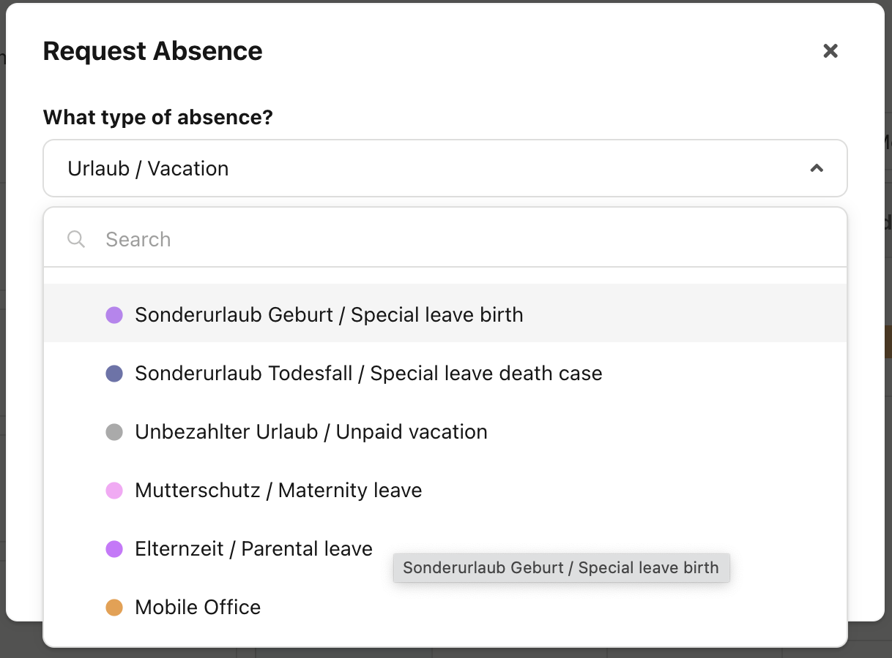

### Personio Automation Project

This project is a simple automation script that uses the current profile in `chrome` that you're already using to skip
having log into Personio or google

---
#### Current Features:

- [x] Absences for `today/range of dates` with a specific `type` of absence `(e.g. Mobile Office)`
- [ ] Supports arguments, and sub-commands
- [ ] Supports `half-day` absences
- [ ] Supports different platforms `(e.g. Firefox) and different OSs (e.g. Linux)`
- [ ] Maybe containerization with `Docker` for cross-platform support ? 🤔

---

#### Prerequisites:

- Login to `Personio` in your `Chrome Browser` in your `default profile`

---

#### How to use:
- Install the requirements with `pip3 install -r requirements.txt` within your virtual environment
- add `config.json` file with the following structure: having the monthly url within your company, and including your employee id
  and the browser you're using
  - ⚠️ Only supported browser is `chrome` on `MacOs` for now ⚠️

```
{
  "PERSONIO_ABSENCE_URL": "https://xxxxxx.personio.de/time-off/employee/xxxxxx/monthly",
  "BROWSER": "chrome"
}
```
- in `main.py`  you can find the following function:

```
request_absence(
    driver=driver,
    absence_type="Mobile Office",
    start_date=today,
    end_date=today,
)
```

then run the script with `python3 main.py`

- `absence_type` is the type of absence you want to request. It can be "Mobile Office"
    - BTW it doesn't have to be the full name, it can be just "Mobile" or "Office" and it will still work as it's
      relying on searching the drop-down.



- `start_date` and `end_date` are the dates you want to request the absence for. They are in the format "YYYY-MM-DD"